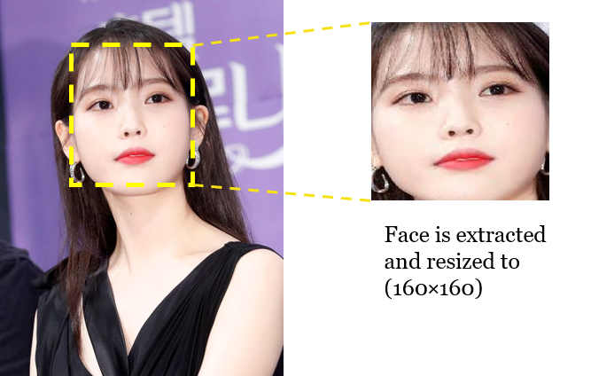
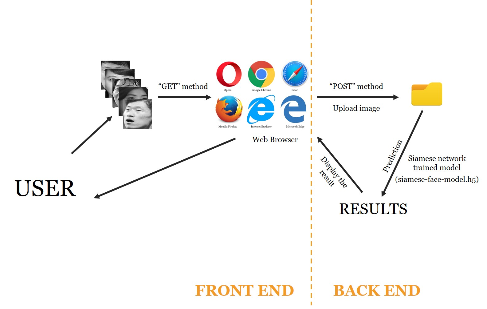

## Siamese Network &mdash; Unofficial Keras Implementation [[Paper]](https://www.cs.cmu.edu/~rsalakhu/papers/oneshot1.pdf)

  

Image from Andrew Ng's [CNN W4L03 : Siamese Network](https://www.youtube.com/watch?v=g3UGGAEbw_Q) course

## 1. Standard Classification vs One Shot Classification
-----
### Standard Classification

  

### One Shot Classification

  

## 2. Motivations
-----
### What’s wrong with Standard Classification?
1. Large number of images of each class required for training.
2. Cannot expect to test another class images with the network trained on the specified classes.
3. Network must be “re-trained” if class(es) with many images are added.

### Standard Classification does not fit for the following applications:
1. When the total number of classes are huge
2. When the number of classes is dynamically changing
3. When it’s difficult to collect the images of a class
4. When the cost of data collection and periodical re-training is too high

[Examples] face recognition, signature recognition, item identification in retail, etc.

### Siamese Network Comes into Play
1. Our brain doesn’t need thousands of pictures of the same object in order to be able to identify it.
2. Only one training example for each class required (That’s why the training is called “One Shot”.)
3. Siamese networks are a special type of neural network architecture which learns to differentiate between two inputs instead of learns to classify them.

  

## 3. Usage
-----
### (1) Collect images
Using [`google_images_download`](https://pypi.org/project/google_images_download/) Python library some celeb faces are collected (`data-downloading.py`).

  

### (2) Extract faces
Faces were extracted using [`MTCNN`](https://github.com/ipazc/mtcnn) (`face-extraction.py`).

  

  

### (3) Select Faces
Some faces are missing or unwanted faces are found from the downloaded images via `google_images_download` library.

The selection of the faces are done manually by checking the images one after another.

* The image on the left is download with the keyword “Chen YenXi”, but the extracted face on the right is not her face.

* So I selected the 20 images per person with wanted faces extracted from the 50 downloaded images.

### (4) Convert the extracted face images to grayscale
Selected images (faces) were converted to grayscale (`convert-to-gray.py`).

### (5) Save the pairs dataset as numpy format
(`siamese-nework-face-data-preparation.py`)

`similar pairs` and `dissimilar pairs` dataset are randomly chosen and saved as numpy data format.

### (6) Train
(`siamese-nework-face-train.py`)

* Base network

* Distance measure (Euclidian distance)

* Loss(cost) function: Contrastive Loss

You can find an article about "Good explanations on Ranking Loss" in [here](https://gombru.github.io/2019/04/03/ranking_loss/).

### (7) Predict
(`siamese-nework-face-prediction.py`)

Firstly, a reference(anchor) image is chosen and feed-forwarded through the trained Siamese network to get the embedding(feature) vector - `featVec_1`.

Next, an image per the category is chosen and feed-forwarded through the trained Siamese network to get the embedding(feature) vector - `featVec_i`, i = 1, ..., N where N is the number of categories.

Next, find `i` such that the distance of `featVec_i` from `featVec_1` is minimum and then `i` is the category the reference(anchor) belongs to.

## 4. Bonus
-----
(`app.py`)

Try to test in your web browser using the Flask app!

